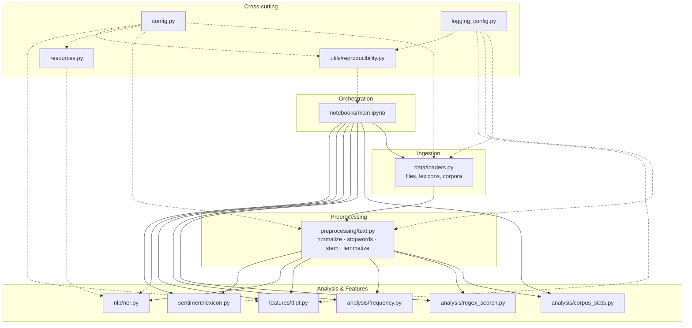
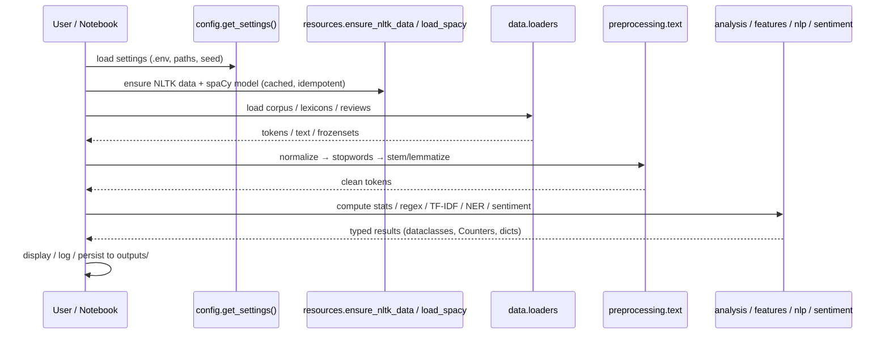

<!-- markdownlint-disable MD033 MD041 -->
<div align="center">

# 🧠 NLP Toolkit

**A production-grade, modular toolkit for classic Natural Language Processing — refactored out of a single coursework notebook into typed, tested, reusable Python.**

[](#prerequisites)
[](https://pip.pypa.io/)
[](#testing)
[](https://docs.astral.sh/ruff/)
[](https://mypy-lang.org/)
[](LICENSE)

</div>

---

## Table of Contents

- [Overview](#overview)
- [The Problem It Solves](#the-problem-it-solves)
- [Features](#features)
- [Architecture](#architecture)
- [Project Structure](#project-structure)
- [Application Flow](#application-flow)
- [Technologies & Rationale](#technologies--rationale)
- [Prerequisites](#prerequisites)
- [Installation](#installation)
- [Running the Application](#running-the-application)
- [Usage Examples](#usage-examples)
- [Configuration & Environment Variables](#configuration--environment-variables)
- [Testing](#testing)
- [Extending the Project](#extending-the-project)
- [Conventions & Best Practices](#conventions--best-practices)
- [Reproducibility](#reproducibility)
- [Troubleshooting](#troubleshooting)
- [Roadmap & Future Improvements](#roadmap--future-improvements)
- [License](#license)

---

## Overview

This repository implements eight classic NLP tasks over the **NLTK Gutenberg
corpus** and a small set of bundled local documents (product reviews, news
texts, sentiment lexicons):

1. Per-document corpus statistics (word/sentence counts, vocabulary richness).
2. Whole-corpus analysis (largest/smallest document, frequency distributions).
3. Regular-expression word search.
4. Text normalization → stemming → lemmatization → POS tagging.
5. Stopword removal.
6. Named-entity recognition (spaCy).
7. Lexicon-based sentiment polarity.
8. TF-IDF term ranking.

The project began life as a single exploratory Jupyter notebook. It has been
**refactored into a layered, typed and unit-tested package** (`nlp_toolkit`),
while the notebook remains as a thin orchestrator that simply wires inputs to the
toolkit and displays results.

## The Problem It Solves

Exploratory NLP notebooks are great for learning but quickly become unmaintainable:
logic is duplicated cell-by-cell, state leaks through global variables, there are
no tests, paths and constants are hard-coded, and nothing is reusable outside the
notebook. **This project demonstrates how to turn such a notebook into
production-quality software** without changing what it computes:

- Reusable, importable functions instead of copy-pasted cells.
- Centralized, environment-aware configuration (no magic values).
- A dependency-free unit-test suite that runs in milliseconds.
- Structured logging, type hints, docstrings and a documented architecture.

The result is equally suitable as a **learning reference for clean NLP
engineering** and as a **starter skeleton** for real text-processing pipelines.

## Features

- 🧱 **Layered, modular package** — one responsibility per module.
- 🧪 **21 dependency-free unit tests** — core logic verified without downloading
  NLTK/spaCy data.
- ⚙️ **Centralized config** via an immutable, cached `Settings` dataclass with
  `.env` overrides.
- 🚀 **Performance-minded** — `frozenset` lookups, `collections.Counter`,
  compiled regexes, cached resource loading, deferred heavy imports.
- 🔁 **Reproducible** — single-call seeding and pinned dependencies.
- 📓 **Notebook as orchestrator** — readable, no business logic inside cells.

## Architecture

The code follows **Separation of Concerns** and a light **Clean Architecture**
layout. Each NLP stage is an independent, testable module; cross-cutting concerns
(configuration, logging, resource bootstrap, reproducibility) sit alongside the
layers and are consumed by all of them.



**How the components interact**

| Component | Responsibility | Depends on |
|-----------|----------------|------------|
| `config` | Single source of truth for paths, seeds, model names, tunables | — |
| `logging_config` | Idempotent structured logging setup | — |
| `resources` | Idempotent, cached NLTK-data / spaCy-model bootstrap | `config` |
| `data` | All file & corpus I/O (text, CSV lexicons, reviews, Gutenberg) | `config` |
| `preprocessing` | Token normalization, stopwords, stemming, lemmatization | `config` |
| `analysis` | Corpus statistics, regex search, frequency distributions | `preprocessing` |
| `features` | TF-IDF vectorization & top-term ranking | (sklearn, numpy) |
| `nlp` | spaCy named-entity recognition | `resources` |
| `sentiment` | Lexicon-based polarity scoring | — (tokenizer injectable) |
| `utils` | Reproducibility (seeding) | `config` |

> **Design principle:** heavy third-party imports (`nltk`, `spacy`, `sklearn`,
> `numpy`) are deferred to *call time*, so `import nlp_toolkit` is fast and
> side-effect-free, and the pure-logic modules stay unit-testable.

## Project Structure

```text
nlp/
├── notebooks/
│   ├── main.ipynb              # Thin orchestrator: inputs → toolkit → output
│   └── data/                   # Bundled corpora & lexicons (inputs)
├── src/
│   └── nlp_toolkit/            # The installable package
│       ├── __init__.py
│       ├── config.py           # Centralized, env-aware settings (no magic values)
│       ├── logging_config.py   # Structured logging setup
│       ├── resources.py        # Idempotent NLTK/spaCy bootstrap (cached)
│       ├── data/               # File & corpus loading (text, CSV, Gutenberg)
│       ├── preprocessing/      # Normalize · stopwords · stem · lemmatize
│       ├── analysis/           # Corpus stats · regex search · frequency
│       ├── features/           # TF-IDF ranking
│       ├── nlp/                # spaCy named-entity recognition
│       ├── sentiment/          # Lexicon-based polarity
│       └── utils/              # Reproducibility helpers
├── tests/                      # pytest suite (dependency-free unit tests)
├── docs/
│   └── ARCHITECTURE.md         # Design decisions & preserved behaviour
├── outputs/                    # Generated artifacts (git-ignored)
├── .env.example                # Documented environment-variable template
├── .python-version             # Pins Python 3.12
├── pyproject.toml              # Dependencies + packaging + pytest/ruff/mypy config
├── requirements.txt            # Pinned dependencies (runtime + dev tools) for pip
└── README.md
```

**Folder responsibilities**

| Folder | Responsibility |
|--------|----------------|
| `notebooks/` | Human-facing orchestration; no business logic. |
| `notebooks/data/` | Read-only input corpora and lexicons. |
| `src/nlp_toolkit/` | All reusable, importable, tested logic. |
| `tests/` | Automated verification of the package. |
| `docs/` | Architecture and decision records. |
| `outputs/` | Generated results (ignored by git). |

## Application Flow

End-to-end, a typical run looks like this:



1. **Configuration** is loaded once (cached), reading optional `.env` overrides.
2. **Resources** (NLTK data, spaCy model) are downloaded only if missing.
3. **Ingestion** reads corpora and lexicons through `data.loaders`.
4. **Preprocessing** normalizes and cleans tokens.
5. **Analysis/Features** produce typed results.
6. The **orchestrator** displays them (and may persist to `outputs/`).

## Technologies & Rationale

| Technology | Why it's used |
|------------|---------------|
| **Python 3.12+** | Modern typing (`X \| None`, `slots=True` dataclasses); required by the latest NumPy 2.5. |
| **pip** + **venv** | Standard, ubiquitous package & environment management. Installs the pinned dependency set from `requirements.txt` with no extra tooling. |
| **NLTK** | Provides the Gutenberg corpus, tokenizers, stopwords, WordNet lemmatizer, Porter stemmer and POS tagger used across exercises. |
| **spaCy** (`en_core_web_sm`) | Fast, accurate named-entity recognition (exercise 6). |
| **scikit-learn** | `TfidfVectorizer` for robust TF-IDF feature extraction (exercise 8). |
| **NumPy** | Efficient array sorting for TF-IDF top-term selection. |
| **python-dotenv** | Twelve-factor configuration via `.env` without hard-coding. |
| **pytest** | Concise, fixture-driven testing; suite is dependency-free by design. |
| **ruff** | Extremely fast linter + import sorter (replaces flake8/isort). |
| **mypy** | Static type checking to catch contract errors before runtime. |

## Prerequisites

- **Python 3.12+** — pinned in `.python-version` (3.12). NumPy 2.5+ requires
  3.12, so older interpreters are not supported. Verify with `python --version`.
- **pip** — bundled with modern Python (upgrade with
  `python -m pip install --upgrade pip`).
- ~600 MB free disk for the dependency stack, NLTK data and the spaCy model.
- Internet access on first run (to download dependencies and resources).

## Installation

The project is installed with **pip** into a standard virtual environment. The
pinned dependency set lives in `requirements.txt`:

```bash
# 1. Clone and enter the project
git clone <your-repo-url> nlp && cd nlp

# 2. Create and activate a virtual environment (Python 3.12+)
python -m venv .venv
# Windows (PowerShell): .venv\Scripts\Activate.ps1
# Unix / macOS:         source .venv/bin/activate

# 3. Install the pinned dependencies (runtime + dev tools)
python -m pip install --upgrade pip
pip install -r requirements.txt

# 4. Download the spaCy model (NLTK data is fetched automatically on first run)
python -m spacy download en_core_web_sm
```

To work on the package itself, install it in editable mode so `nlp_toolkit`
is importable from anywhere:

```bash
pip install -e .          # runtime only
pip install -e ".[dev]"   # + dev tools (pytest, ruff, mypy, jupyter)
```

> **Resources:** NLTK corpora are downloaded automatically the first time the
> notebook (or `nlp_toolkit.resources.ensure_nltk_data`) runs. Only the spaCy
> model must be installed manually, with the command above.

> `requirements.txt` holds fully-pinned versions for reproducible installs;
> `pyproject.toml` declares the version ranges and is the source of truth when
> adding or upgrading a dependency.

## Running the Application

### Notebook (recommended)

With the virtual environment activated and dependencies installed (see
[Installation](#installation)), make sure the spaCy model is present and launch
Jupyter (NLTK data downloads itself on first run):

```bash
python -m spacy download en_core_web_sm   # one-time, if not already installed
jupyter lab notebooks/main.ipynb          # or: jupyter notebook
```

> **In VSCode / Cursor:** open `notebooks/main.ipynb` and select this project's
> `.venv` as the kernel. Make sure you installed the dev extras
> (`pip install -e ".[dev]"`) so the Jupyter kernel is available.

Run the cells top-to-bottom. The first code cell bootstraps the import path,
logging, seeding and resources; each subsequent cell solves one exercise.

### Download resources only

```bash
python -m spacy download en_core_web_sm   # spaCy model (NLTK data is automatic)
```

### Use the toolkit from your own code

See [Usage Examples](#usage-examples) below.

## Usage Examples

**Corpus statistics**

```python
from nltk.corpus import gutenberg
from nlp_toolkit.analysis import compute_corpus_stats

stats = compute_corpus_stats(
    gutenberg.words("shakespeare-hamlet.txt"),
    gutenberg.sents("shakespeare-hamlet.txt"),
)
print(stats.total_words, stats.unique_words, round(stats.words_per_sentence, 2))
```

**Lexicon-based sentiment**

```python
from nlp_toolkit.config import get_settings
from nlp_toolkit.data import load_lexicon
from nlp_toolkit.sentiment import LexiconSentimentAnalyzer, SentimentLexicon

s = get_settings()
analyzer = LexiconSentimentAnalyzer(
    SentimentLexicon(
        positive=load_lexicon(s.positive_words_path),
        negative=load_lexicon(s.negative_words_path),
    )
)
print(analyzer.polarity("The pictures are razor-sharp. I love this camera."))
```

**Named-entity recognition**

```python
from nlp_toolkit.data import load_text_file
from nlp_toolkit.nlp import count_entities_by_label
from nlp_toolkit.config import get_settings

text = load_text_file(get_settings().data_dir / "french-revolution.txt")
labels = count_entities_by_label(text)
print(labels["GPE"], labels["PERSON"])
```

**TF-IDF top terms**

```python
from nltk.corpus import gutenberg
from nlp_toolkit.preprocessing import preprocess_for_tfidf
from nlp_toolkit.features import top_tfidf_words

texts = ["carroll-alice.txt", "melville-moby_dick.txt"]
docs = [preprocess_for_tfidf(gutenberg.raw(t)) for t in texts]
print(top_tfidf_words(docs, labels=texts, top_n=5))
```

## Configuration & Environment Variables

All tunables live in [`src/nlp_toolkit/config.py`](src/nlp_toolkit/config.py) as
an immutable, cached `Settings` dataclass. Override any of them with environment
variables (optionally via a `.env` file — copy [`.env.example`](.env.example)).
**Relative directory paths are resolved against the repository root**, so the
same `.env` works from a notebook, a script or CI.

| Variable | Default | Description |
|----------|---------|-------------|
| `NLP_DATA_DIR` | `notebooks/data` | Location of input corpora/lexicons (relative → repo root). |
| `NLP_OUTPUT_DIR` | `outputs` | Where generated artifacts are written (auto-created). |
| `NLP_RANDOM_SEED` | `42` | Seed for all RNGs (reproducibility). |
| `NLP_LANGUAGE` | `english` | Stopword / model language. |
| `NLP_SPACY_MODEL` | `en_core_web_sm` | spaCy pipeline used for NER. |
| `NLP_ENCODING` | `utf-8` | Default text encoding for file I/O. |
| `NLP_TOP_N` | `5` | Default number of "top" items reported. |

```bash
cp .env.example .env   # then edit as needed
```

## Testing

```bash
pytest                       # run the full suite (21 tests)
pytest --cov=nlp_toolkit     # with coverage
ruff check .                 # lint + import order
mypy                         # static type checking
```

> Run these with the virtual environment activated (and the dev extras
> installed via `pip install -e ".[dev]"`).

**What kinds of tests exist**

- **Unit tests** (`tests/test_*.py`) cover the pure-logic modules:
  preprocessing, corpus statistics, regex search, frequency, sentiment scoring
  and data loaders.
- They are **intentionally dependency-free**: tokenizers are injected and the
  cached stopword set is monkey-patched, so no NLTK data or spaCy model is
  required and the suite runs in milliseconds.
- **Integration tests** (against real NLTK/spaCy/sklearn) are **not yet
  included** — see the [Roadmap](#roadmap--future-improvements). The notebook
  currently serves as a manual end-to-end check.

**Interpreting results:** a passing run ends with a line of dots and
`21 passed`. A failure shows the failing test, the asserted vs. actual values and
a traceback pointing at the offending module/line.

## Extending the Project

The architecture makes adding a new capability predictable. To add, say, a
**readability-metrics** feature:

1. **Create the module** under the right layer, e.g.
   `src/nlp_toolkit/features/readability.py`.
2. **Write pure, typed functions** that accept plain inputs (token lists or
   text) and return typed results (dataclass / `dict` / `Counter`). Defer heavy
   imports to call time.
3. **Read configuration** via `get_settings()` instead of hard-coding values;
   add new tunables to `Settings` (and `.env.example`) if needed.
4. **Export the public API** in the sub-package `__init__.py`.
5. **Add unit tests** in `tests/`, injecting any tokenizer/dependency so the
   test stays dependency-free.
6. **Wire it into the notebook** as a thin orchestration cell.
7. **Run** `ruff check . && mypy && pytest` before committing.


## Conventions & Best Practices

- **Layout:** `src/` layout; one responsibility per module; public API exported
  via each package's `__init__.py`.
- **Typing:** full type hints; `from __future__ import annotations`; immutable
  `@dataclass(frozen=True, slots=True)` for value objects.
- **Naming:** `snake_case` for functions/variables/modules, `PascalCase` for
  classes, `UPPER_SNAKE` for constants; descriptive names over abbreviations
  (the old `sc_`/`sh_`/`sm_` globals are gone).
- **Docstrings:** Google-style (`Args` / `Returns` / `Raises`) on public
  functions and classes.
- **Logging over printing:** library code logs via `logging_config`; only the
  notebook prints for display.
- **No magic values:** all constants/paths come from `config`.
- **Dependency injection:** tokenizers and lexicons are injected to keep core
  logic testable and decoupled.
- **Style/quality gates:** `ruff` (line length 100, rules `E,F,I,UP,B,C4,SIM`)
  and `mypy` are configured in `pyproject.toml`.

## Reproducibility

`nlp_toolkit.utils.seed_everything()` fixes the Python, `PYTHONHASHSEED` and
NumPy seeds in one call (default `42`, configurable via `NLP_RANDOM_SEED`).
Dependencies are fully pinned in `requirements.txt`, and resource bootstrap is
deterministic and idempotent.

## Troubleshooting

| Symptom | Fix |
|---------|-----|
| `RuntimeError: spaCy model ... is not installed` | `python -m spacy download en_core_web_sm` |
| `LookupError` from NLTK | Re-run the notebook bootstrap cell, or call `python -c "from nlp_toolkit.resources import ensure_nltk_data; ensure_nltk_data()"` |
| `pip install` fails to overwrite `.venv` (Access denied, Windows) | Close any process using it (IDE Python/Jupyter kernel), then recreate the venv. |
| Resolution error mentioning Python version | Ensure Python **3.12+** (`python --version`); install 3.12 if older. |
| `ModuleNotFoundError: nlp_toolkit` | Activate the venv and `pip install -e .` from the repo root |
| Notebook can't import the package | Launch Jupyter from the repo root so `../src` resolves |

## Roadmap & Future Improvements

- [ ] Add **integration tests** (marked) exercising real NLTK/spaCy/sklearn paths.
- [ ] Add **CI** (GitHub Actions) running `ruff`, `mypy` and `pytest` with coverage gates.
- [ ] Replace the lexicon sentiment heuristic with **VADER / transformer** models and proper negation scope.
- [ ] Use **POS-aware spaCy lemmatization** instead of WordNet's default-noun lemma.
- [ ] Persist exercise outputs to `outputs/` as JSON/CSV for diffable runs.
- [ ] Optional **CLI** (`python -m nlp_toolkit ...`) wrapping each task.
- [ ] Package and publish to a private index.

> See [`docs/ARCHITECTURE.md`](docs/ARCHITECTURE.md) for design decisions and the
> behaviour intentionally preserved from the original coursework (e.g. exercise 4
> stem-then-lemmatize, exercise 7 parity-based negation rule) and the bug fixed
> in exercise 5 (word count vs. character count).

## License

Released under the **MIT License** — see [LICENSE](LICENSE) for the full text.
